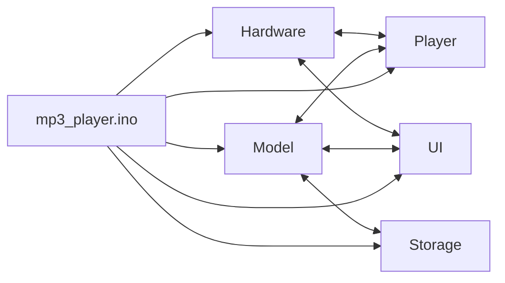

# ESP32 MP3 Player Framework (LVGL)

A modular ESP32-S3 MP3 player framework focused on real device UX: fast navigation, theme support, metadata-aware playback, and a clean state-driven architecture.

This project is designed as a foundation for iPod-style custom firmware experiences, not just a single demo sketch.

## Why This Project

Most ESP32 MP3 examples stop at "play a file."  
This project goes further with:

- Stateful app architecture (`AppState` + `PlayerState`)
- Multi-screen LVGL UI (`Now Playing`, `Search`, `Library`, `Favorites`, `Screensaver`, `Error`)
- Metadata-aware playback (ID3 / stream title integration path)
- Theme system groundwork for runtime skin switching
- Extensible input model (touch + optional hardware buttons)

## Current Feature Set

- SD card library scan with album index
- Playback controls: play/pause, prev/next, volume, seek
- Repeat/shuffle modes
- Favorites persistence (`/favorites.txt`)
- Sleep timer
- Screensaver + display-off idle behavior
- EQ presets mapped to `Audio.setTone(...)`
- Compile-ready modular codebase

## Architecture



### Module Responsibilities

- `Config.h`: board pins, timing, optional button/touch config
- `Model.*`: state machine, shared app model, metadata fields
- `Hardware.*`: LVGL port, display/touch, LED, battery, timers, button polling
- `Player.*`: playback control, seek, EQ, audio callbacks
- `Storage.*`: SD scan, albums, favorites, library helper queries
- `Ui.*`: all LVGL screens and event handling

## Hardware Target

Primary target is ESP32-S3 with:

- TFT display (via `TFT_eSPI`)
- I2S DAC / amp output
- SD card for local MP3 files
- Optional touch input (`TOUCH_CS`)  
- Optional hardware buttons (`BTN_*_PIN` in `Config.h`)

## Build and Flash

Because LVGL + audio stack is larger than default app partition, use `huge_app`:

```powershell
arduino-cli compile --fqbn esp32:esp32:esp32s3:PartitionScheme=huge_app .\mp3_player
```

If touch is not configured in your TFT_eSPI setup, either:

- define `MP3_PLAYER_TOUCH_CS` in `mp3_player/Config.h`, or
- configure `TOUCH_CS` in TFT_eSPI `User_Setup.h`

## Quick Start

1. Copy MP3 files to SD card.
2. Build and upload with the command above.
3. Boot device and verify:
   - library scan completes
   - track loads on startup
   - seek/volume/playback controls respond

## Project Structure

```text
MP3CalarProje/
  README.md
  mp3_player/
    mp3_player.ino
    Config.h
    Model.h / Model.cpp
    Hardware.h / Hardware.cpp
    Player.h / Player.cpp
    Storage.h / Storage.cpp
    Ui.h / Ui.cpp
    lv_conf.h
```

## Roadmap

### Milestone 1: Framework Baseline
- `NavigationController`
- `InputManager` (touch + button + encoder)
- `ThemeManager`
- persistent settings store

### Milestone 2: iPod-Like Interaction
- wheel/encoder-first navigation
- standardized screen transitions
- redesigned `Now Playing` visual language

### Milestone 3: Media Depth
- queue model (`up next`, history)
- playlist CRUD
- album art caching
- richer library browsing (artist/genre/index jump)

### Milestone 4: Stability and Quality
- state transition tests
- metadata parser tests
- SD edge-case tests
- perf and memory diagnostics view

## TODO (Action List)

### Core
- [ ] Add `NavigationController` abstraction
- [ ] Add `InputManager` abstraction
- [ ] Add `ThemeManager` runtime token map
- [ ] Add persistent settings (`theme`, `brightness`, `sleep`, `eq`)
- [ ] Add typed error code map for UI

### Player
- [ ] Implement queue model and queue-aware repeat/shuffle
- [ ] Add long-press seek scrub preview
- [ ] Add optional fade-in/fade-out track transition
- [ ] Expose balance/mute in UI

### Library
- [ ] Add artist/album/genre segmented browsing
- [ ] Add A-Z quick jump
- [ ] Add lazy list rendering for large libraries
- [ ] Add album art thumbnail cache

### UX and Device
- [ ] Add full theme preview/apply flow
- [ ] Add low-battery profile (brightness and behavior)
- [ ] Add hardware wheel profile (if encoder present)
- [ ] Add diagnostics page (heap/fps/decode state)

## Notes

- This repository is actively evolving toward a reusable MP3 firmware framework.
- Breaking changes are expected while architecture hardens.
